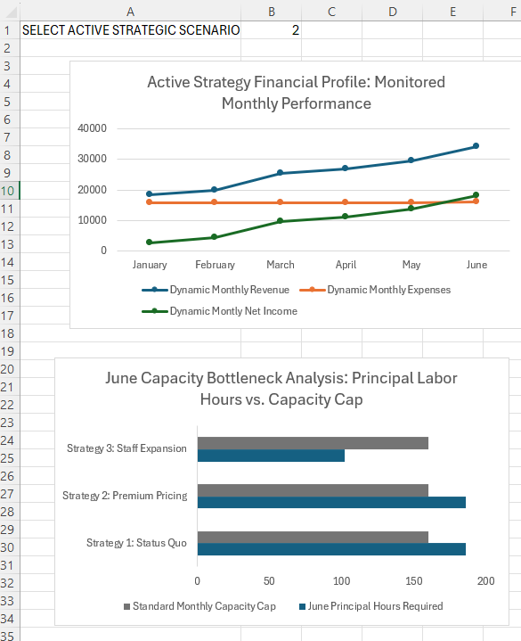

# Welcome to my Virtual Portfolio! 👋

Hi, I'm glad you're here. This space serves as my professional "Show, Don't Tell" portfolio, where I translate messy, real-world data into highly structured business intelligence, financial models, and interactive simulations. 

Whether you are a hiring manager auditing my technical work or just stopping by to see what I've been building, you can interact with the complete documentation below.

### 📥 Master Asset Download
* **[Click Here to Download the Interactive Excel Simulation Workbook](./Cahaba%20Structural%20Engineering%20Simulation%20Workbook.xlsx)** 
*(Download this file to test the live dropdown toggles, variable switches, and dynamic logic layers locally on your desktop.)*

---

## 📊 Feature Project: Cahaba Structural Engineering Simulation

**Project Type:** Professional Services Master Budget & Capacity Optimization Model  
**Core Objective:** Model a complex milestone cash-flow lifecycle, identify a hard 160-hour monthly labor bottleneck, and simulate three competing scaling strategies for an engineering firm.

###  The Strategic Simulation Dashboard (Capacity vs. Cash Flow)
The firm faces a dual challenge: hitting a critical wall in June due to a hard 160-hour principal labor cap, and navigating a severe near-term margin squeeze introduced by step-fixed overhead when trying to hire staff.
Below is a snapshot of the live executive dashboard capturing the complete operational and financial reality in a single view. The interactive toggle instantly recalculates the firm's profile across three distinct strategic choices. The visual contrast in the charts proves that while delegating work to a junior engineer completely clears the physical burnout crisis, a value-based premium pricing model actually optimizes short-term cash flow more effectively without expanding fixed infrastructure.

---

## 🚀 Future Expansions & Tech Stack
This portfolio is a living ecosystem. While this model anchors my advanced managerial accounting frameworks in **Microsoft Excel**, I am currently engineering future data layers to expand this space, including:
* **Tableau Interactive Dashboards** for multi-variable visual discovery.
* **Python Data Pipelines** to automate historical data ingestion and flat-file cleaning.
